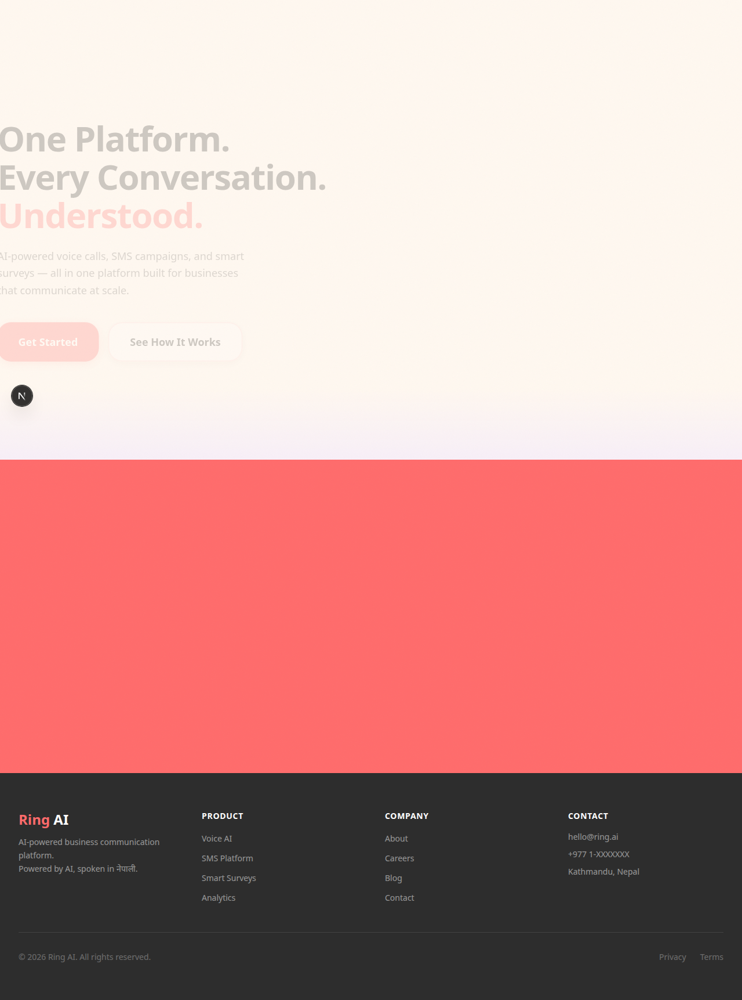
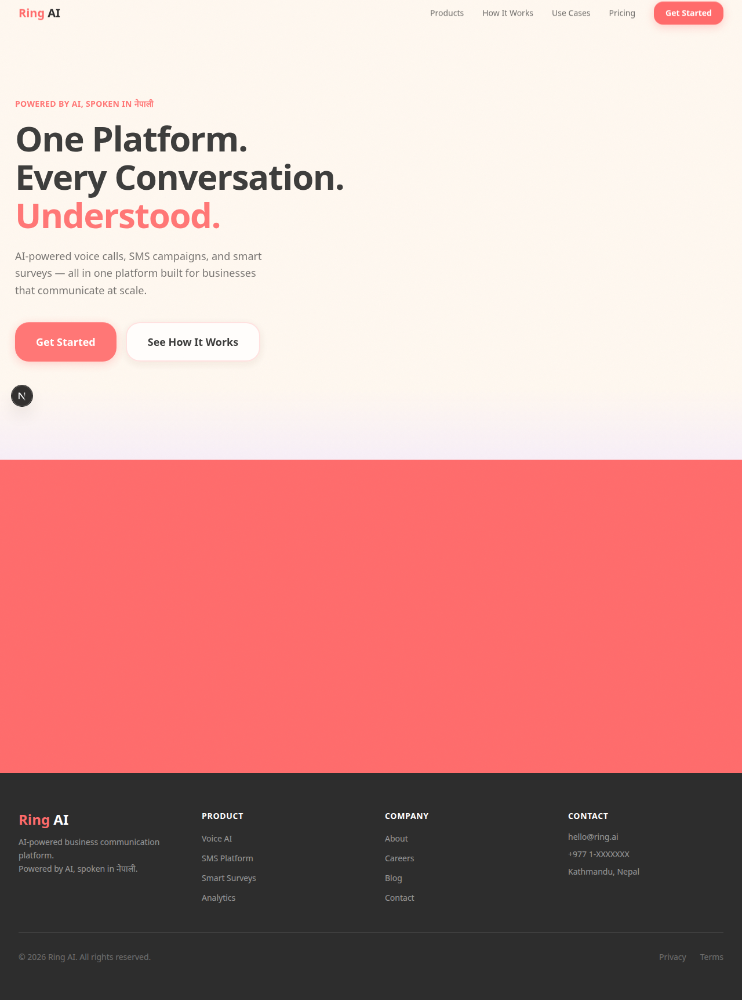
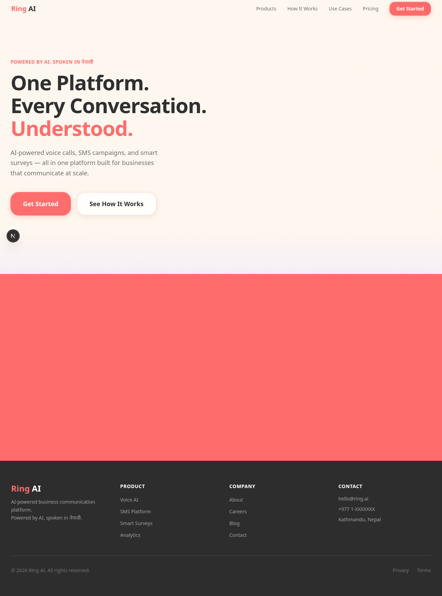
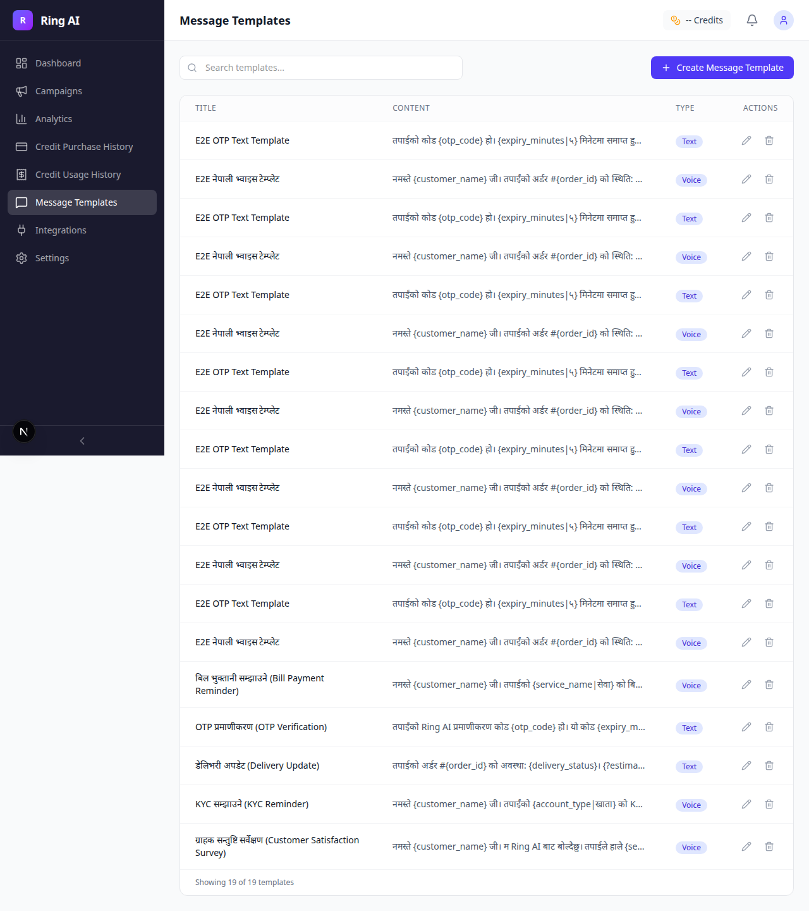
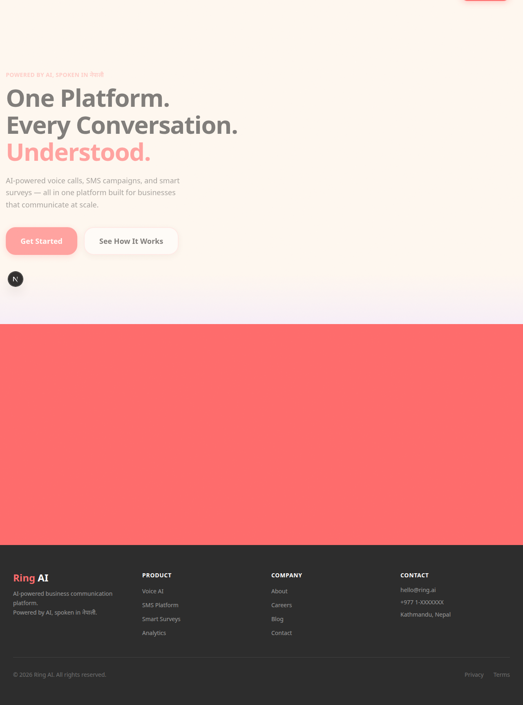
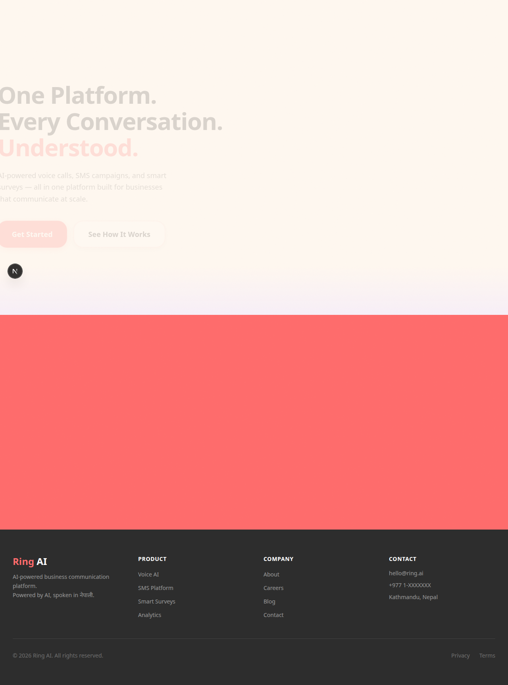

# Ring AI

Voice campaign platform with TTS, SMS, and survey capabilities.

## Structure

```
ring_ai/
├── backend/          # Python FastAPI
│   ├── app/
│   │   ├── api/v1/   # Versioned API endpoints
│   │   ├── core/      # Config, database
│   │   ├── models/    # SQLAlchemy models
│   │   ├── services/  # Business logic
│   │   └── tts/       # TTS provider integrations
│   ├── alembic/       # DB migrations
│   └── tests/
├── frontend/         # Next.js 15 + TypeScript + Tailwind
│   └── src/app/
├── docker-compose.yml
└── Makefile
```

## Setup

### Prerequisites

- Python 3.12+
- Node.js 22+
- PostgreSQL 16+ (or use Docker)
- [uv](https://docs.astral.sh/uv/) for Python dependency management

### Backend

```bash
cd backend
cp .env.example .env
uv sync
uv run uvicorn app.main:app --reload --port 8000
```

### Frontend

```bash
cd frontend
npm install
npm run dev
```

### Docker (all services)

```bash
docker compose up -d
```

### Run tests

```bash
make test
```

## Product Screenshots

Core flows captured from E2E validation runs:

### Dashboard Overview


### Campaign List


### Analytics Overview


### Template Management


### OTP Send Flow


### Settings and KYC


## API Endpoints

| Prefix | Purpose |
|--------|---------|
| `/health` | Health check |
| `/api/v1/voice/` | Voice call endpoints |
| `/api/v1/text/` | SMS endpoints |
| `/api/v1/forms/` | Survey endpoints |
| `/api/v1/campaigns/` | Campaign CRUD |
| `/api/v1/templates/` | Template CRUD |
| `/api/v1/analytics/` | Metrics |
